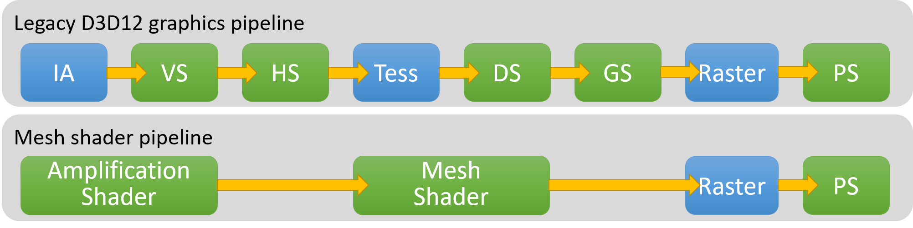

# Mesh Shaders

## The Graphics Pipeline

Here you can see in this diagram form the DirectX 12 documentation, the chain of shader types executed by the GPU when an object is rendered. The blue nodes represent fixed hardware functions, fixed hardware mean that it physically exists on the GPU silicium, hence it can't be programmed, that's why we call it fixed hardware functions, usually these fixed hardware functions act as the glue between the different stages of the shaders by passing and converting data from one stage to another.

In this guide, we'll focus on the Mesh Shader Pipeline which is the new preferred way of rendering objects in new graphics APIs. You'll see that it's simpler to understand because it has less stages and fixed hardware functions. If you want to learn more about the legacy graphics pipeline stages, you can read more in the [DirectX 11 documentation](https://learn.microsoft.com/en-us/windows/win32/direct3d11/overviews-direct3d-11-graphics-pipeline).

### Amplification Shaders

The amplification shader is an optional stage in the mesh shader pipeline that can take any data as input and outputs a list of vertices and primitives for the next stage (Mesh Shader). A vertex stores all the data needed to describe a mesh, usually each vertex has it's position, UVs, normal, etc. but the encoding of such data is fully controllable so you could pack data in any particular way you want as long as you have the code to interpret it correctly in the mesh shader.

// TODO: find another way to say that, too technical too early
This stage is called Amplification because it can generate more geometry as output than it has as input. Such use case is very handy as it serves as a replacement for the tessellation and facilitate LOD technique implementation.

If this stage is not present, the mesh shader will be called for each vertex

### Fragment Shaders

## References

https://gpuopen.com/learn/mesh_shaders/mesh_shaders-from_vertex_shader_to_mesh_shader/