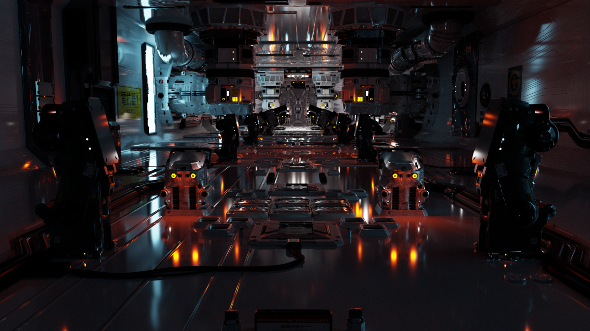

# The Meaning of PBR

Physically based rendering (or PBR for short) is a way of describing how to render virtual content using equations derived from the observation of the real world. Most of the time, this methodology focuses on rendering photorealistic images but it can also be used for stylized rendering when more artistic control is given.

PBR has become the standard nowadays in most of the renderers because of the many advantages it provides both on the artistic level and engine level. It is used in most of the films in cinema to match what is filmed in reality or completely replace it, it's even use in highly stylized films like Pixar or Disney.

There is something valuable in having light behaving "as you expect in reality" in a virtual world as you can make use of your intuition instead of just knowing all the rules.

## Why using PBR?

PBR is not only a fancy thing to render photorealistic images, it has real implications on how virtual assets are created and proposes a standard way of authoring content and explains how to render it.

This standardization means that artists can re-use and share the knowledge of how to create content between different projects and even proposes asset libraries that are compatible between different engines or renderer. In a way, you can see this standard way of creating content as an interface that when implemented correctly will make your content compatible with any renderer supporting the PBR workflow.

In PBR, the lighting also become standard, this is because we need to use the equations derived from the observations of the real world, it means that for those equations to work, we also need the units that comes with them. This means that all the lighting will be quantified in [physical light units](https://en.wikipedia.org/wiki/Luminous_intensity) which is great as it allows to use real-world values in the virtual world.

PBR also enables new workflows base on capturing real-world content, this is called photogrammetry, the idea is pretty simple: take a bunch of photos of an existing object and use these images to automatically model a 3D object out of it. And honestly, real-world data is the best source of PBR content because it's our ultimate reference so it seems like a good idea to take models directly from the real world

## Separation between Materials and Lighting

A very important concept of PBR is the separation between how a surface is modeled and how it interact with lights.

Before the PBR workflow, to create a virtual asset you would create the 3D model in the software of your choice and then apply a set of textures to give it colors and describe how light interact with it. This set of texture could contain lighting information, often baked into the color of the object. Which is a problem if you want your lighting to be dynamic, since it's baked into the 3D asset, the renderer has no idea what this light is and just treat is as a color. You can see how this conflicts with the light simulation done by the renderer, if the model already contain light information, how the renderer will interact with it? This workflow placed a heavy burden on artist as they had to take care of both the authoring of the surface and a part of the lighting.

PBR splits the authoring of 3D content in two: Material and Lighting and inserts a standard interface in between. You can think of the material as a set of texture and parameters that describes how the surface interact with light (for example how rough a surface is, or is it metallic, which color is it, etc.).

On the lighting part, the renderer expect that the materials in the scene provide this standardized set of inputs, so it's lighting algorithm can work properly. It's important to note that this set of standard textures is not finite and additional textures can be provided to the renderer to enhance the quality of the rendering like displacement maps or curvature maps which provide more information about the surface of the model itself.

Here is an example of different textures that combined creates a photorealistic rendering of a rock. Don't worry about the meaning of those textures for now, everything will be explained when we'll actually start creating materials.

<table>
  <tr>
    <th>Final Render</th><th>Albedo</th><th>Ambient Occlusion</th>
  </tr>
  <tr>
    <td width=33.3%></td>
    <td width=33.3%></td>
    <td width=33.3%></td>
  </tr>
</table>

<table>
  <tr>
    <th>Displacement</th><th>Normal</th><th>Roughness</th>
  </tr>
  <tr>
    <td width=33.3%></td>
    <td width=33.3%></td>
    <td width=33.3%></td>
  </tr>
</table>

## Approximations

Doing perfect light simulation is impossible as it would mean to simulate how the light interact with each electron of the matter in your scene, so instead we rely on known equations describing the behaviour of light on certain objects. One example is the [Snell Law](https://en.wikipedia.org/wiki/Snell%27s_law) which describes how the direction of light changes when entering a new medium (think of how water distorts the light and causes refraction).

You'll see in the future that these formulas can also become quite expensive to compute so we'll use approximations to ensure that we mainly reasonable frame time for real-time rendering (30 fps or more). These approximations will introduce a errors in the rendering, we'll see in future chapiters how to measure those errors compared to a "reference".

Note that to keep things simple, our reference will not be the real world as it would require a complex setup to capture all the lighting infromation required to make a good comparison. If you're interested in practical uses of real reference data in video games, check out [The Rendering Of Callisto Protocol](https://advances.realtimerendering.com/s2023/SIGGRAPH2023-Advances-The-Rendering-of-The-Callisto-Protocol-JimenezPetersen.pdf).

## References

https://renderman.pixar.com/

https://en.wikipedia.org/wiki/Physically_based_rendering

https://pbr-book.org/4ed/contents

https://en.wikipedia.org/wiki/Luminous_intensity

https://advances.realtimerendering.com/s2023/SIGGRAPH2023-Advances-The-Rendering-of-The-Callisto-Protocol-JimenezPetersen.pdf