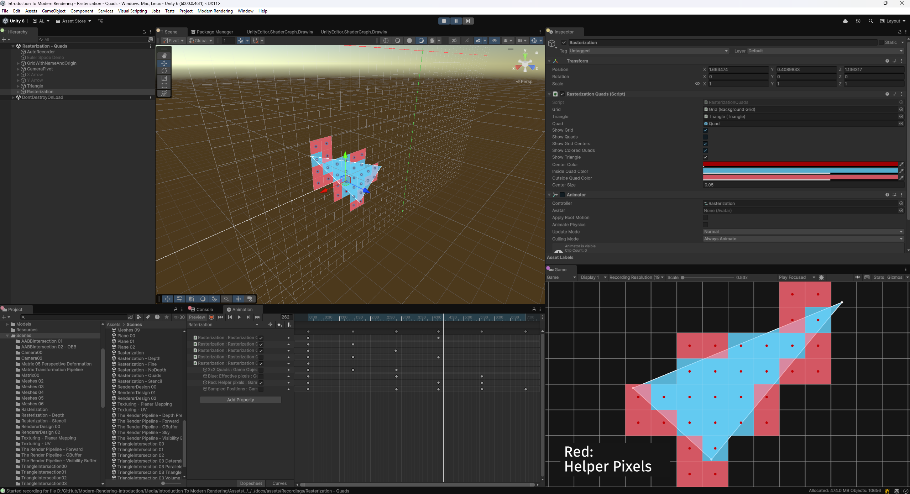

This repository contains the source code for the **Modern Rendering Introduction** course, along with its accompanying renderer. The course is free and open source, with a focus on explaining fundamental concepts behind real-time 3D scene rendering.

## Online Course

You can access the online course here: https://alelievr.github.io/Modern-Rendering-Introduction

The course website is built using a Jekyll theme, available at: [jekyll-gitbook](https://github.com/alelievr/jekyll-gitbook). The pages are written in Markdown and can be found in the [docs/_articles](https://github.com/alelievr/Modern-Rendering-Introduction/tree/master/docs/_articles) folder.

## Renderer

This GitHub repository also includes the D3D12 renderer used in the course. It is written in C++ and leverages the [FlyCube](https://github.com/andrejnau/FlyCube) library to reduce boilerplate code.

## Unity Media Project

Most of the images and GIFs featured in the course are generated using a Unity project located in the [Media/Introduction To Modern Rendering](https://github.com/alelievr/Modern-Rendering-Introduction/tree/master/Media/Introduction%20To%20Modern%20Rendering) folder. If you're interested in seeing how the GIFs are made or wish to modify them, you can open the project using Unity 6.0 LTS.

## Future Plans

Planned pages and upcoming improvements are tracked on the following GitHub project page: [Modern Rendering Course](https://github.com/users/alelievr/projects/2).
