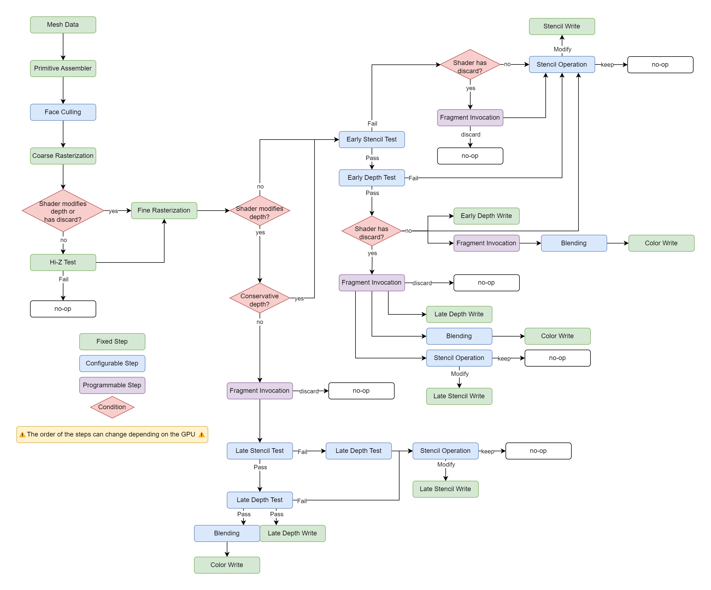

# Rasterization

Rasterization is probably one of the most known and used part of the GPU, this is an essential step when rendering polygonal meshes to the screen. Generally when we talk about rasterization on the GPU we mean to talk about the process of transforming arbitrary geometry into pixels on screen, while this is definition is not wrong, it lacks precision as there are underlying steps that are important to have a good idea of what rasterization is.

> Note that for the sake of clarity I'll only talk about how the rasterizer work in a Discrete GPU. If you're interested in learning how rasterization work with different architectures like TBRD check out [GPU architecture types explained
](https://www.rastergrid.com/blog/gpu-tech/2021/07/gpu-architecture-types-explained/).

Let's take a look at a diagram representing all the steps happening during rasterization of a very simple shader. Note that the order of some steps can change depending on the graphics API or GPU but the overall layout remains similar.


We'll try to explain each step of the diagram in the following sections, but before, something important to keep in mind is that the number of steps in the rasterization pipeline can change depending on the feature used inside the fragment shader. The image above describe the simplest case of a shader that only writes color data and doens't use [discard](https://learn.microsoft.com/en-us/windows/win32/direct3dhlsl/dx-graphics-hlsl-discard) instructions.

For reference, here's what the pipeline could look like if we take in account depth write and discard operations:



As you can see it's quite a bit more complex and it doesn't include all the cases, we could add MSAA, conservative depth, coverage, etc. 

## From Linear To Discrete

The process of rasterization in itself is simple, it consist in converting a series of 2D shapes into pixels. In our case these shapes represent the transformed data from the mesh shaders and the final pixels represent the output image that we want to render. You can see this process as overlaying a grid of the same size as the output image on top of the geometry and then calculating the color of the triangle only if it intersect with the center of each cell.

// TODO: image

In a sense you can see this process as turning the input geometry which has infinite resolution (linear) into a finite resolution matching the output image. This process is called [Discretization](https://en.wikipedia.org/wiki/Discretization) and introducing the infamous aliasing that you've probably seen countless times in video games or graphic apps. We'll see that in more details in the following chapter when dealing with textures.

## Primitive Assembly

This is the first step of the rasterization process. Technically it can be considered outside because it's only part of the setup before the actual rasterization starts.

The Primitive Assembler takes data from the mesh and turn it into a list of Primitives for the rasterizer to process. Most of the time these primitives are triangle but the rasterizer support other type of primitive like lines and points.

To form these primitives, the assembler reads the index buffer linking vertices together. It's possible to specify how the GPU should read this index buffer to form the triangle by specifying the type of [topologies](https://learn.microsoft.com/en-us/windows/win32/direct3d11/d3d10-graphics-programming-guide-primitive-topologies), that way you can form triangle strips or fans.

## Viewport Clipping & Scissors Test

## Face Culling

This step removes any non-visible triangles, it helps improving the performance as the culled triangles will not produce any work for the fragment shader. This step can be controlled by the culling mode of the rasterizer. It has 3 different modes:

- **Cull Off / None**

    This option disables the face culling so that all triangles that are in the view will go trough the next stages of rasterization.

- **Cull Back**

    This is the most common cull mode, it cull the "back" side of all the visible triangles.    

- **Cull Front**

    Used for special effects, culls the "front" side of the visible triangles. 

To determine which side the triangle is facing, we use the winding order or winding direction.
It indicates the rotation direction in which the vertices are arranged to form the triangle. Usually this order is automatically chosen by the 3D modeling software exporting the mesh. There is a rasterizer state that you can configure to adapt to the winding order of the meshes, you can either set it to **Clockwise** or **Counter Clockwise**.


## Coarse/Tile Rasterization

This step consist into rasterizing the input geometry at a low resolution to check if the triangle overlaps a tile (8x8 pixels for example). If the triangle overlaps a tile, then it can proceed to the next stages.

## Hierarchical-Z Test

When **Depth Testing** is enabled in the rasterization config, the GPU can perform an early depth test on the tiles from the coarse rasterization. This is also an optimization that allows to early out the rasterization process in case the whole tile of pixels fail the depth test.

To know the result of the depth test for the whole tile without computing the depth of every pixels in the tile, the GPU uses a conservative approximation of the depth at each corner of the tile. For this reason Hierarchical-Z Test cannot be enabled when the fragment shader uses pixel discard instructions or modifies the depth of the object (see 2nd diagram at the top).

## Fine Rasterization

Now that we know which tile passed the tests, it means that a part of the triangle overlaps the tile. The fine rasterization step determines which pixel in the tile actually intersect the triangle.

From this point, the granularity of the work is per pixel.

// TODO: gif

### Fill Mode

When rendering polygons using the rasterizer tou can also specify a **Fill Mode** it lets you choose how you want the polygons to appear, Usually there only 3 choices:
- Fill: The default option, it renders the triangle surface.
- Line: Only renders the edges of the polygons.
- Point: Only renders the vertices of the polygons.

## Stencil Test

Stencil Testing is an important feature of the GPU, it's purpose is to discard pixels (early out the rasterization) to optimize the rendering of an object. It is mainly used to perform special effects such as having an object visible only behind another one or making objects disappear when the camera gets close to see through them.

// TODO: stencil glasses example

In order to early out those pixels, the stencil test reads the value of the **Stencil Buffer**, this texture contains 8 bit per pixel of data. This data is then compared with a fixed value to evaluate if the stencil test passes or fails.

If the stencil test fails, then the pixel is immediately discarded and it doesn't show on the screen.
If the stencil test passes, then the pixel can proceed to the next steps of the rasterization process.

The stencil test is something that can be configured and not programmed (see the diagram above), this configuration is often exposed by the different graphics API as a structure or handle that holds values relevant to perform the stencil test. In this structure you can generally find these values:

Name | Description
--- | ---
Stencil Enabled | 
Reference Value | TODO
Read Mask | 
Write Mask | 
Fail Operation | 
Pass Operation | 
Depth Fail Operation | 
Function | 

If we translate this into code, we can see the stencil test like so:

```c
if (StencilEnabled())
{
    uint8_t stencilBufferValue = StencilBuffer[pixelCoordinate] & StencilReadMask;
    uint8_t stencilReferenceValue = GetStencilStateReferenceValue() & StencilReadMask;

    uint8_t result = 0;
    if (StencilCompare(stencilBufferValue, stencilReferenceValue))
    {
        if (DepthTestPassed())
            result = StencilPassOperation();
        else
            result = StencilDepthFailOperation();
    }
    else
        result = StencilFailOperation();

    result &= StencilWriteMask;
    StencilBuffer[pixelCoordinate] = (StencilBuffer[pixelCoordinate] & ~StencilWriteMask) | result;
}
```

Usually this stencil test is performed before any fragment shader is invoked, this allows to have a cheap early out mechanism. But depending on what the shader is doing (writing depth or using a pixel discard instruction for example), the stencil test can actually be performed after the invocation. This significantly reduces the performances when rendering such objects but it's sometimes necessary to achieve certain effects.

## Depth Test

Depth Testing is probably one of the most used feature of the rasterizer. It's purpose to make sure that the objects are correctly occluded. Without the depth testing, every objects will appear on the screen based on the order they where rendered with the last ones appearing on top of everything even if they should be behind other objects.

// TODO: gif

To make sure that the objects are occluded, we use another texture called **Depth Buffer**, this texture stores the depth (not distance) of each pixel on the screen. To check if a new pixel is occluded or not, we just have to compare the depth inside the texture and the depth of the new pixel, if it's larger, then the pixel is discarded as it's occluded and if it's lower, then the pixel can proceed to the following stages of rasterization.

Just like the stencil test, dept test can be configured with these properties:

Name | Description
--- | ---
Depth Enabled | TODO
Comparison Function | 
Depth Write | 

> Note that the depth values inside the depth textures are stored normalized (between 0 to 1 in DirectX, Metal and Vulkan and from 1 to -1 in OpenGL). This means that you need conversion functions using the projection matrix parameters to recover the actual depth of the pixel.

## Depth Write

This step is pretty straightforward, depending on the depth state, we write the new depth value into the depth buffer.

## Fragment Invocation

This steps is the only programmable part of the rasterizer, for each pixel tha successfully made it there the fragment shader is called to compute the final color of the pixel.

### Vertex Interpolation

Every attributes passed to the input of the fragment shader gets interpolated using barycentric coordinates. This interpolation can be controlled using [Interpolation Modifiers](https://learn.microsoft.com/en-us/windows/win32/direct3dhlsl/dx-graphics-hlsl-struct#interpolation-modifiers-introduced-in-shader-model-4), the control how values from the mesh vertices are interpolated and even allow you to disable interpolation if you need it.

### Pixel discard

The [discard](https://learn.microsoft.com/en-us/windows/win32/direct3dhlsl/dx-graphics-hlsl-discard) instruction in HLSL allows to exit the rasterization without writing to any output. It is useful if you want to programmatically control which pixel to discard in cases where depth and stencil testing are not flexible enough. For example pixel discard are often used for foliage or vegetation to cutout the complex shapes of leaves.

As mentioned above in the diagram, adding a discard instruction in the fragment shader automatically moves all the early depth and stencil tests after the fragment shader evaluation making them less interesting in terms of performance.

### Quads & Helper Pixels

One particularity of the rasterizer is that the minimum unit it can process is not a single pixel but actually 4, we call this a quad and represent a 2x2 pixel shape. 

Having the guarantee that at least 4 adjacent pixels are being processed at the same time is neat as it allows to do calculation between the values of those pixels. This is what the [ddx](https://learn.microsoft.com/en-us/windows/win32/direct3dhlsl/dx-graphics-hlsl-ddx) and [ddy](https://learn.microsoft.com/en-us/windows/win32/direct3dhlsl/dx-graphics-hlsl-ddy) instructions do, these instruction calculate the rate of change of the value passed in parameter and are essential for texture filtering. We'll see them more in detail in the chapter about filtering and texturing.

// TODO: gif of helper pixels

## Blending & Output Merger

## Conservative Rasterization

## Multisampling (MSAA)

## Variable Rate Shading

## Misc

Talk about Occlusion Queries, depth bounds, z-clip, etc.

## References

https://en.wikipedia.org/wiki/Rasterisation

https://www.rastergrid.com/blog/gpu-tech/2021/07/gpu-architecture-types-explained/

https://learn.microsoft.com/en-us/windows/win32/direct3d12/conservative-rasterization

https://registry.khronos.org/vulkan/specs/1.3-extensions/man/html/VK_AMD_rasterization_order.html

https://fgiesen.wordpress.com/2011/07/05/a-trip-through-the-graphics-pipeline-2011-part-5/
https://fgiesen.wordpress.com/2011/07/06/a-trip-through-the-graphics-pipeline-2011-part-6/
https://fgiesen.wordpress.com/2011/07/08/a-trip-through-the-graphics-pipeline-2011-part-7/

https://learn.microsoft.com/en-us/windows/win32/direct3d11/d3d10-graphics-programming-guide-rasterizer-stage-rules#triangle-rasterization-rules-without-multisampling

https://www.khronos.org/opengl/wiki/Face_Culling

https://www.asawicki.info/news_1654_stencil_test_explained_using_code
