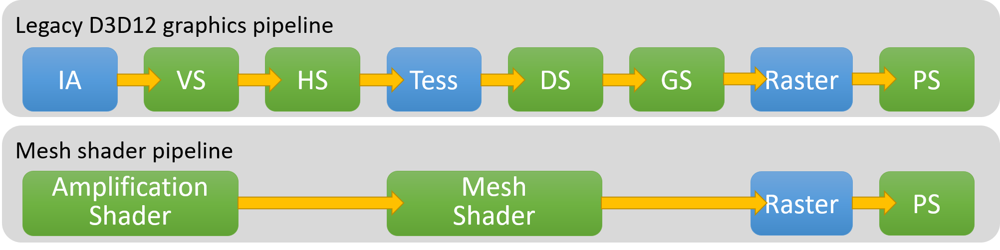

# Shaders

A shader is a very lightweight program that runs on the GPU, it is designed to be spawned quickly from CPU commands such as dozens or hundreds of different shaders runs every frame. Shader are designed to work exclusively with the resources of GPU, so in term of feature set it's a lot more restricted than CPU programs (for example you cannot allocate memory on the GPU).
The API to use the GPU is still evolving fast a new features are becoming unlocked as new hardware and drivers are released, a lot of the design choices on the rendering architecture come from these limitations.

For example one of the most limiting things on the GPU right now is that it's impossible to run a GPU program from the GPU. It's always the CPU that triggers work on the GPU, but recently a new API is being designed to allow dispatching work from the GPU: the [Work Graphs](https://devblogs.microsoft.com/directx/d3d12-work-graphs/).

It's still very new and not much implementation exists yet so I'm not going to use it in this course. What we'll try to do is to maximize the use of the GPU for every part of the renderer so when the Work Graph API becomes more widely implemented, we can transition to it pretty easily.

## Different types of shaders

The GPU supports multiple kind of shaders, each of them have access to different hardware features and are integrated in the graphics pipeline of the GPU.

Several pipeline exist in the GPU, each pipeline has it's type of shaders that you can execute inside.

### The Graphics Pipeline

Here you can see in this diagram form the DirectX 12 documentation, the chain of shader types executed by the GPU when an object is rendered. The blue nodes represent fixed hardware functions, fixed hardware mean that it physically exists on the GPU silicium, hence it can't be programmed, that's why we call it fixed hardware functions, usually these fixed hardware functions act as the glue between the different stages of the shaders by passing and converting data from one stage to another.

In this guide, we'll focus on the Mesh Shader Pipeline which is the new preferred way of rendering objects in new graphics APIs. You'll see that it's simpler to understand because it has less stages and fixed hardware functions. If you want to learn more about the legacy graphics pipeline stages, you can read more in the [DirectX 11 documentation](https://learn.microsoft.com/en-us/windows/win32/direct3d11/overviews-direct3d-11-graphics-pipeline).

#### Amplification Shaders

The amplification shader is an optional stage in the mesh shader pipeline that can take any data as input and outputs

#### Mesh Shaders

#### Rasterization

#### Fragment Shaders

### Ray Tracing Pipeline

Raytracing shaders

### Compute Pipeline

The compute pipeline on the GPU only allows one type of shader to be executed: the compute shader.This is the simplest type of shader, it's multi-purpose and doesn't have access to any fixed hardware function, it's very good to do general purpose computation on the GPU ([GPGPU](https://fr.wikipedia.org/wiki/General-purpose_processing_on_graphics_processing_units)). Compute shaders are dispatched directly using a number of threads, it is the equivalent of having a job system handling all the boilerplate of starting jobs and distributing work between the workers.

## GPU Architecture

Modern GPUs are massively parallel and allow to run tens of thousands of threads at the same time, so it is crucial to keep in mind that we need to dispatch a large amount of tasks each time we want to execute something. Luckily the workload of rendering an image can be easily divided by each texel of the resulting image, for reference in a full HD image, there is a bit more than 2 million texels (1920 x 1080) so it'll be plenty of work to fill the GPU.

The current rendering API are command based, which means that they use a pattern where the CPU is recording all the operation that the GPU needs to execute consecutively and then this command is passed to the GPU for execution. This command list is called a Command Buffer. Due to this command buffer pattern, the execution of shaders on the GPU is mostly serial (following the command buffer order) with little overlap between the different shaders executed. (note that this overlap is not necessarily wanted as running a lot of different shader programs on the GPU means that the GPU needs to switch context a lot and if there is not enough work dispatched per shader, it will result in most of the GPU doing nothing as a single SIMD block can only execute a single shader at a time. TODO: check this information).

## Languages

## References

https://devblogs.microsoft.com/directx/d3d12-work-graphs/

https://devblogs.microsoft.com/directx/dev-preview-of-new-directx-12-features/

https://microsoft.github.io/DirectX-Specs/d3d/Raytracing.html
