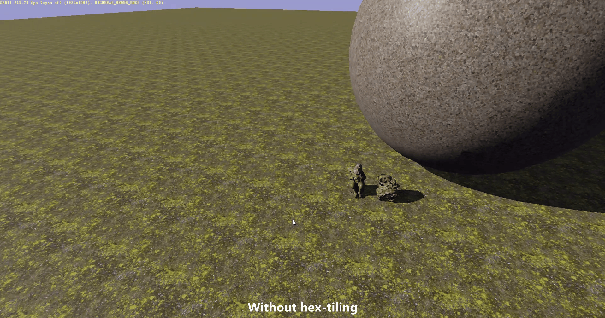

# Texturing

Texturing or [Texture Mapping](https://en.wikipedia.org/wiki/Texture_mapping) is very important in rendering, it's so important that GPUs have dedicated hardware to read, filter and decompress those textures on the fly. A texture can contain any kind of data, while it is most used to store a standardized set of material attributes, it can also be used for anything else, even storing animations. Texture mapping is the process of taking a texture and applying on a mesh in a certain way. You can also see the texture mapping system as an indirection used to fetch the surface data of the object.

## UV Mapping

This is the most common way of applying textures to a mesh. As we saw in the chapter about [meshes](Meshes.md#texture-coordinates-uv), **UV Mapping** uses pre-determined texture coordinates that act as an indirection for a 2D texture to be applied to a 3D mesh. Because UV coordinates are embedded in the mesh, the texture is authored specifically for that mesh unless other meshes share the same UV layout. This is the case for tileable textures, where the texture is designed to be repeated multiple times and can be used on meshes that support it.

This is the most common way of applying textures to a mesh. As we saw in the chapter about [meshes](Meshes.md#texture-coordinates-uv), **UV Mapping** uses pre-determined texture coordinates that act as an indirection for a 2D texture to be applied to a 3D mesh. Instead of mapping a texture directly based on the 3D position of a vertex, each vertex stores a set of **UV coordinates**, which are essentially 2D positions within a texture. These coordinates are then used by the shader to sample one or more textures.

This [Sample](https://learn.microsoft.com/en-us/windows/win32/direct3dhlsl/dx-graphics-hlsl-to-sample) operation retrieves the corresponding texel from the image as well as applying some filtering, we'll see this filtering more closely in the next chapter [Aliasing and Filtering](AliasingAndFiltering.md). The texture coordinates used for the sampling are interpolated across the surface of the triangle during [rasterization](Rasterization.md#vertex-interpolation), ensuring smooth texture mapping.

Because UV coordinates are embedded in the mesh, the texture is often authored specifically for that mesh unless other meshes share the same UV layout. An example of UV layout that can be shared is for **tileable textures**, where the texture is designed to be seamlessly repeated across a surface. In this case, the UV coordinates of the mesh extend beyond the usual `[0,1]` range, allowing the texture to wrap continuously without visible seams. This technique is commonly used for materials like brick walls, floors, and fabrics, where a single texture can cover large areas without distortion. To break the effect of repetition, shaders can also modify the UV coordinates dynamically through [Procedural Mapping](Texturing.md#procedural-mapping).

### UDIM Mapping

[UDIM](https://learn.foundry.com/modo/content/help/pages/uving/udim_workflow.html) is an extension of the UV mapping technique, it consist into having multiple UV maps for the mesh, split in squares. This workflow helps when having to handle very high resolution textures by allowing to map multiple textures for a single attribute (albedo for example).

UDIM is an extension of the UV mapping technique. It consists of having multiple UV maps for a mesh, split into squares. This workflow helps when handling very high-resolution textures by allowing multiple textures to be mapped to a single attribute (such as albedo).  

Unlike traditional UV mapping, where all texture data is confined to a single `[0,1]` UV space, UDIM tiles extend beyond this range, enabling multiple textures to be assigned to different parts of the model. Each tile is indexed using a **UDIM number**, which allows rendering engines to dynamically select the appropriate texture based on the UV coordinates of a given fragment.  

This approach is particularly useful in **film, VFX, and high-detail asset creation**, where extreme texture resolution is required without exceeding texture size limits. For instance, a character’s face might use one UDIM tile, while other parts, such as clothing and accessories, are mapped to separate tiles. This division allows for efficient texture streaming and improved memory usage, as only the necessary tiles are loaded when rendering.  

In game development and real-time applications, UDIM workflows are less common. Some engines implement **virtual texturing**, which similarly splits textures into smaller tiles to stream only the visible parts as the player progresses through the game. This is normally used for regular UV-mapped textures but can also simplify the integration of a UDIM workflow into the engine.  

## Procedural Mapping

Procedural mapping is a technique that generates UV coordinates dynamically inside the shader instead of relying on pre-authored UV layouts.

### Planar And Tri-Planar Mapping

Planar mapping is a simple technique that consists of generating UV coordinates as if the texture were projected onto the surface of the mesh from a projector. This is a basic texturing method that can be used on terrains, allowing modifications without the need to recompute the UVs of the entire mesh. **Decals** also use a similar technique to project surface parameters such as color, smoothness, and other material properties onto a mesh.  

Here's a visualization of how a texture, represented by the transparent plane, gets projected onto the sphere. Note that on the sides of the projection, severe stretching artifacts occur—this is one of the limitations of this technique.  

  

**Tri-planar mapping** extends this concept by projecting the texture from three axes instead of just one. These three axes are often aligned with the world-space basis, and having three projections instead of one allows the shader to dynamically choose the least distorted projection. This is typically done by using the surface normal to determine which projection to apply. By blending between multiple projections, stretching artifacts are eliminated at the cost of additional computations.  

You can learn more about this projection technique in this video: [I Explored Tri-planar Texture Mapping](https://www.youtube.com/watch?app=desktop&v=7TodHAg3pOU).  

### Hexagonal Tile Mapping

This technique is designed to break the visual repetition that occurs when tiling a texture over a large area, such as a terrain.

It works by generating small UV patches in a hexagonal shape and arbitrarily rotating them to break the repetition. It works particularly well with textures that contain organic elements, which are not organized in a pattern easily recognizable by the human eye.

If you're interested in this technique, you can take a look at this GitHub project: [hextile-demo](https://github.com/mmikk/hextile-demo).

## Conclusion

Texturing is a fundamental aspect of 3D rendering; it is what allows textures to be applied to meshes. From UV mapping to advanced methods like hexagonal tile mapping, there are numerous ways to apply textures to meshes. Each technique has its strengths and weaknesses and is better suited to different types of content.

By understanding the various methods available, you can choose the best approach to suit your project's needs and address problems such as visual repetition, texture resolution, aliasing, etc. Experimenting with these techniques will provide new ways to improve the visual quality of your environments.

## References

- 📄 [Texture mapping - Wikipedia](https://en.wikipedia.org/wiki/Texture_mapping)
- 📄 [UV mapping - Wikipedia](https://en.wikipedia.org/wiki/UV_mapping)
- 📄 [Texture Mapping Solutions - Autodesk](https://www.autodesk.com/solutions/texture-mapping)
- 📄 [UDIM Workflow - Modo | Foundry](https://learn.foundry.com/modo/content/help/pages/uving/udim_workflow.html)
- 📄 [Ptex: Per-face Texture Mapping for Production Rendering - Disney](https://media.disneyanimation.com/technology/opensource/ptex/ptex-slides.pdf)
- 📄 [HexTile Demo - GitHub](https://github.com/mmikk/hextile-demo)
