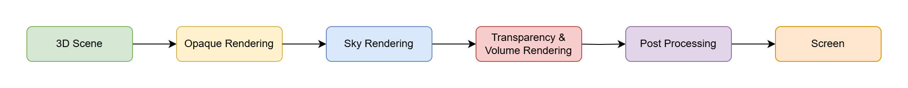

# The Render Pipeline

Now that we know how to render objects using the GPU, we'll see the different steps needed to render a complete scene with many different graphics features like transparency, shadows, fog, etc. This list of steps is what we call the **Render Pipeline** and essentially describes all the process needed to compose the final image on your screen.

The following diagram provides a very high level overview of the content of a generic render pipeline.

Note that the techniques used to render each box greatly varies depending on the requirements of the renderer. To achieve optimal performance, the design of the renderer must take in account the kind of content in your 3D scenes.

- Lots of static geometry VS dynamic geometry
- Large open world VS small map
- Massive instancing and reuse of models VS lots of unique assets
- Lots of materials VS a few materials
- Highly detailed meshes with small triangles and automatic LODs VS manually authored LODs
- Lots of dynamic lights VS baked lighting

All of these choses help determine the best technology to adopt for your renderer.

## Opaque Rendering

Rendering opaque objects is often the first step, this is because it allows to generate a depth buffer used by the following passes and thus minimizes the amount of overdraw in the scene.

There are a lot of techniques to render opaque geometry, the two main ones are known as Forward and Deferred.

## Sky Rendering

## Transparency and Volume Rendering

## Post Processing
