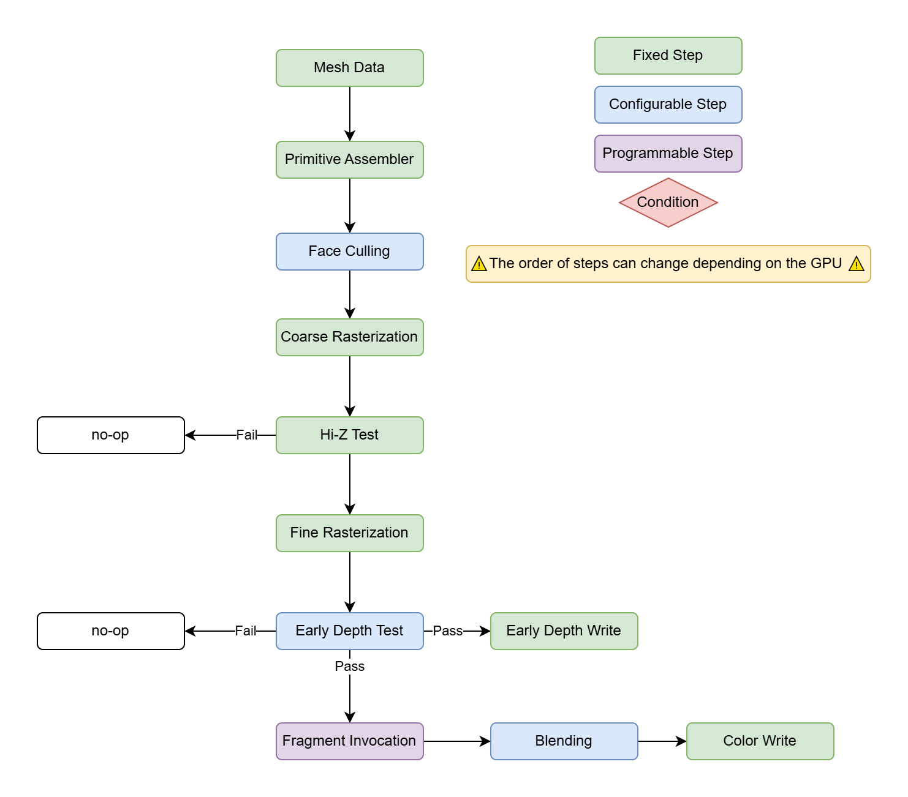
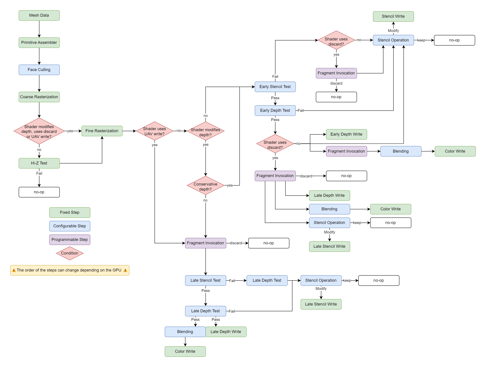
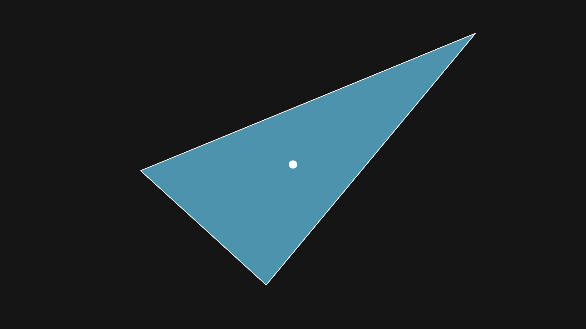

Rasterization is probably one of the most known and used part of the GPU, this is an essential step when rendering polygonal meshes to the screen. Generally when we talk about rasterization on the GPU we mean to talk about the process of transforming arbitrary geometry into pixels on screen, while this is definition is not wrong, it lacks precision as there are underlying steps that are important to have a good idea of what rasterization is.

> Note that for the sake of clarity I'll only talk about how the rasterizer work in a Discrete GPU. If you're interested in learning how rasterization work with different architectures like TBRD check out [GPU architecture types explained
](https://www.rastergrid.com/blog/gpu-tech/2021/07/gpu-architecture-types-explained/).

Let's take a look at a diagram representing all the steps happening during rasterization of a simple shader. Note that the order of some steps can change depending on the graphics API or GPU but the overall layout remains similar.



We'll try to explain each step of the diagram in the following sections, but before, something important to keep in mind is that the number of steps in the rasterization pipeline can change depending on the feature used inside the fragment shader. The image above describe the simplest case of a shader that only writes color data and doens't use [discard](https://learn.microsoft.com/en-us/windows/win32/direct3dhlsl/dx-graphics-hlsl-discard) instructions.

For reference, here's what the pipeline could look like if we take in account depth write and discard operations:



As you can see it's quite a bit more complex and it doesn't include all the cases, we could add MSAA, alpha coverage, VRS, etc.

## From Linear To Discrete

The process of rasterization in itself is simple, it consist in converting a series of 2D shapes into pixels. In our case these shapes represent the transformed data from the mesh shaders and the final pixels represent the output image that we want to render. You can see this process as overlaying a grid of the same size as the output image on top of the geometry and then calculating the color of the triangle only if it intersect with the center of each cell.



In a sense you can see this process as turning the input geometry which has infinite resolution (linear) into a finite resolution matching the output image. This process is called [Discretization](https://en.wikipedia.org/wiki/Discretization) and introducing the infamous aliasing that you've probably seen countless times in video games or graphic apps. We'll see that in more details in the following chapter when dealing with textures.

## Primitive Assembly

This is the first step of the rasterization process. Technically it can be considered outside because it's only part of the setup before the actual rasterization starts.

The Primitive Assembler takes data from the mesh and turn it into a list of Primitives for the rasterizer to process. Most of the time these primitives are triangle but the rasterizer support other type of primitive like lines and points.

To form these primitives, the assembler reads the index buffer linking vertices together. It's possible to specify how the GPU should read this index buffer to form the triangle by specifying the type of [topologies](https://learn.microsoft.com/en-us/windows/win32/direct3d11/d3d10-graphics-programming-guide-primitive-topologies), that way you can form triangle strips or fans.

## Viewport Clipping & Scissors Test

The viewport represent the rectangular area where your triangles are rendered, anything outside this area will get culled. Usually the viewport matches the size of the output texture so that every part of the triangles that are outside of the camera gets clipped.

Scissors testing is setup by specifying a list of 2D rectangles relative to the viewport area where the pixels in these area will get culled.

## Face Culling

This step removes any non-visible triangles, it helps improving the performance as the culled triangles will not produce any work for the fragment shader. This step can be controlled by the culling mode of the rasterizer. It has 3 different modes:

- **Cull Off / None**

    This option disables the face culling so that all triangles that are in the view will go trough the next stages of rasterization.

- **Cull Back**

    This is the most common cull mode, it cull the "back" side of all the visible triangles.    

- **Cull Front**

    Used for special effects, culls the "front" side of the visible triangles. 

To determine which side the triangle is facing, we use the winding order or winding direction.
It indicates the rotation direction in which the vertices are arranged to form the triangle. Usually this order is automatically chosen by the 3D modeling software exporting the mesh. There is a rasterizer state that you can configure to adapt to the winding order of the meshes, you can either set it to **Clockwise** or **Counter Clockwise**.


## Coarse/Tile Rasterization

This step consist into rasterizing the input geometry at a low resolution to check if the triangle overlaps a tile (8x8 pixels for example). If the triangle overlaps a tile, then it can proceed to the next stages.

## Hierarchical-Z Test

When **Depth Testing** is enabled in the rasterization config, the GPU can perform an early depth test on the tiles from the coarse rasterization. This is also an optimization that allows to early out the rasterization process in case the whole tile of pixels fail the depth test.

To know the result of the depth test for the whole tile without computing the depth of every pixels in the tile, the GPU uses a conservative approximation of the depth at each corner of the tile. For this reason Hierarchical-Z Test cannot be enabled when the fragment shader uses pixel discard instructions or modifies the depth of the object (see 2nd diagram at the top).

## Fine Rasterization

Now that we know which tile passed the tests, it means that a part of the triangle overlaps the tile. The fine rasterization step determines which pixel in the tile actually intersect the triangle.

From this point, the granularity of the work is per pixel.


### Fill Mode

When rendering polygons using the rasterizer tou can also specify a **Fill Mode** it lets you choose how you want the polygons to appear, Usually there only 3 choices:

- Fill: The default option, it renders the triangle surface.
- Line: Only renders the edges of the polygons.
- Point: Only renders the vertices of the polygons.

## Stencil Test

Stencil Testing is an important feature of the GPU, it's purpose is to discard pixels (early out the rasterization) to optimize the rendering of an object. It is mainly used to perform special effects such as having an object visible only behind another one or making objects disappear when the camera gets close to see through them.


In order to early out those pixels, the stencil test reads the value of the **Stencil Buffer**, this texture contains 8 bit per pixel of data. This data is then compared with a fixed value to evaluate if the stencil test passes or fails.

If the stencil test fails, then the pixel is immediately discarded and it doesn't show on the screen.
If the stencil test passes, then the pixel can proceed to the next steps of the rasterization process.

The stencil test is something that can be configured and not programmed (see the diagram above), this configuration is often exposed by the different graphics API as a structure or handle that holds values relevant to perform the stencil test. In this structure you can generally find these values:

Name | Description
--- | ---
Stencil Enabled | Controls whether the stencil test is enabled or not.
Reference Value | Set the reference value for the stencil test, this is an 8 bit value.
Read Mask | Controls which bits to read from the stencil buffer, this is an 8 bit mask.
Write Mask | Controls which bits to write to the stencil buffer, this is an 8 bit mask.
Fail Operation | Specify which operation is performed in case the stencil test fails.
Pass Operation | Specify which operation is performed in case the stencil test passes.
Depth Fail Operation | Specify which operation is performed in case the stencil test passes but the depth test fails.
Function | Specify which comparison function is used to check if the stencil test passes (i.e. equal, greater equal, etc.).

If we translate this into code, we can see the stencil test like so:

```c
if (StencilEnabled())
{
    uint8_t stencilBufferValue = StencilBuffer[pixelCoordinate] & StencilReadMask;
    uint8_t stencilReferenceValue = GetStencilStateReferenceValue() & StencilReadMask;

    uint8_t result = 0;
    if (StencilCompare(stencilBufferValue, stencilReferenceValue))
    {
        if (DepthTestPassed())
            result = StencilPassOperation();
        else
            result = StencilDepthFailOperation();
    }
    else
        result = StencilFailOperation();

    result &= StencilWriteMask;
    StencilBuffer[pixelCoordinate] = (StencilBuffer[pixelCoordinate] & ~StencilWriteMask) | result;
}
```

Usually this stencil test is performed before any fragment shader is invoked, this allows to have a cheap early out mechanism. But depending on what the shader is doing (writing depth or using a pixel discard instruction for example), the stencil test can actually be performed after the invocation. This significantly reduces the performances when rendering such objects but it's sometimes necessary to achieve certain effects.

## Depth Test

Depth Testing is probably one of the most used feature of the rasterizer. It's purpose to make sure that the objects are correctly occluded. Without the depth testing, every objects will appear on the screen based on the order they where rendered with the last ones appearing on top of everything even if they should be behind other objects.

Without Depth Test | With Depth Test
--- | ---
 | 

To make sure that the objects are occluded, we use another texture called **Depth Buffer**, this texture stores the depth (not distance) of each pixel on the screen. To check if a new pixel is occluded or not, we just have to compare the depth inside the texture and the depth of the new pixel, if it's larger, then the pixel is discarded as it's occluded and if it's lower, then the pixel can proceed to the following stages of rasterization.

Just like the stencil test, dept test can be configured with these properties:

Name | Description
--- | ---
Depth Enabled | Specifies whether the depth test is enabled or not, if disabled, the depth test will always pass.
Comparison Function | The function used to compare the fragment depth and the depth buffer value.
Depth Write | Specifies whether the fragment should write it's depth value if the depth test passes.

> Note that the depth values inside the depth textures are stored normalized (between 0 to 1 in DirectX, Metal and Vulkan and from 1 to -1 in OpenGL). This means that you need conversion functions using the projection matrix parameters to recover the actual depth of the pixel.

## Depth Write

This step is pretty straightforward, depending on the depth state, we write the new depth value into the depth buffer.

## Fragment Invocation

This steps is the only programmable part of the rasterizer, for each pixel that successfully made it there the fragment shader is called to compute the final color of the pixel.

### Vertex Interpolation

Every attribute (data contained in each vertex) passed to the input of the fragment shader gets interpolated using [barycentric coordinates](https://en.wikipedia.org/wiki/Barycentric_coordinate_system). When a triangle is rasterized, the graphics pipeline determines the value of each attribute at every pixel by blending the values from the three vertices of the triangle.
This blending is performed through interpolation using the [barycentric coordinates](https://en.wikipedia.org/wiki/Barycentric_coordinate_system) of the triangle.
This interpolation ensures a smooth transition of attributes such as position, color, UVs, and more across the surface of the triangle.


This interpolation can be controlled using [Interpolation Modifiers](https://learn.microsoft.com/en-us/windows/win32/direct3dhlsl/dx-graphics-hlsl-struct#interpolation-modifiers-introduced-in-shader-model-4), they control how values from the mesh vertices are interpolated and even allows disabling interpolation if needed.

### Pixel discard

The [discard](https://learn.microsoft.com/en-us/windows/win32/direct3dhlsl/dx-graphics-hlsl-discard) instruction in HLSL allows to exit the rasterization without writing to any output. It is useful if you want to programmatically control which pixel to discard in cases where depth and stencil testing are not flexible enough. For example pixel discard are often used for foliage or vegetation to cutout the complex shapes of leaves.

As mentioned above in the diagram, adding a discard instruction in the fragment shader automatically moves all the early depth and stencil tests after the fragment shader evaluation making them less interesting in terms of performance.

### Multiple Render Targets

The fragment shader can have a maximum of 8 color outputs, each output is 4 channel, so it's a maximum of 32 values representing "color" data that can be output from the fragment shader.

This is an interesting feature that allows to implement more complex rendering algorithms like deferred shading that relies on exporting material properties into a `GBuffer` composed of several render targets.

### Quads & Helper Pixels

One particularity of the rasterizer is that the minimum unit it can process is not a single pixel but actually 4, we call this a quad and represent a 2x2 pixel shape.

Having the guarantee that at least 4 adjacent pixels are being processed at the same time is neat as it allows to do calculation between the values of those pixels. This is what the [ddx](https://learn.microsoft.com/en-us/windows/win32/direct3dhlsl/dx-graphics-hlsl-ddx) and [ddy](https://learn.microsoft.com/en-us/windows/win32/direct3dhlsl/dx-graphics-hlsl-ddy) instructions do, these instruction calculate the rate of change of the value passed in parameter and are essential for texture filtering. We'll see them more in detail in the chapter about filtering and texturing.


As you can see in this animation, there are quite a few helper pixels dispatched by the GPU (shown in red). This triangle is particularly small if you consider that each cell of the grid is a pixel on screen, but in this particular case, we can see that 50% of the fragment shader invoked by the GPU are only dedicated to helping the computation of the other half. This is one of the main reason why small triangles are inefficient on modern GPUs and that we see more and more software rasterizers bypassing this limitation.

The ratio between the effective and helper pixels is called the **Quad Occupancy** and is an important metric to look for when profiling and optimizing a renderer. The quad occupancy can be either 100%, 75%, 50% or 25% in the worst case.

## Blending & Output Merger

Once the fragment shader finished it's execution, the GPU needs to write back the output data (color values and potentially depth) to the main memory of the GPU. This action is executed by the Output Merger.

Inside the output merger stage, we find the blending operation. This is mostly interesting to render transparent surfaces as we want to blend their color with the rest of the scene when they are rendered. This blending operation is another configurable step that can be enabled and configured from the graphics API. Note that the blending operation can only be performed on color data and that you can have a different blending configuration per render target bound (see Multiple Render Target above).

Name | Description
--- | ---
Blend Enabled | Controls whether the blending stage is enabled or not. When rendering opaque objects it is disabled.
Source Color Blend | The value that multiplies the source color (i.e. the color from the fragment shader output).
Destination Color Blend | The value that multiplies the destination color (i.e. the color from the frame buffer).
Color Blend Operation | The operation performed between the source color and destination color.
Source Alpha Blend | The value that multiplies the source alpha (i.e. the alpha from the fragment shader output).
Destination Alpha Blend | The value that multiplies the destination alpha (i.e. the alpha from the frame buffer).
Alpha Blend Operation | The operation performed between the source alpha and destination alpha.
Color Write Mask | Specify which channels of the fragment shader color will affect the blending.

We can also say that the blending is performed by following this formula:

```c
// sourceColor is the output from the fragment shader
// destination color is the value from the FrameBuffer.
output.rgb = (sourceColorBlend * sourceColor) colorBlendOperation (destinationColorBlend * destinationColor)
output.a = (sourceAlphaBlend * sourceAlpha) alphaBlendOperation (destinationAlphaBlend * destinationAlpha)
```

> Note that there is also a mode that allows to perform logic operations like `AND`, `OR`, etc. instead of blending, it can be used on integer typed textures.

The output merger unit is able to perform compression and blending in hardware thus improving performances and bandwidth compared to a manual implementation in a shader. Of course this is at the cost of having limited blending configuration, but they are often enough to cover most cases we encounter in games.

For example the standard transparency can be achieved by using this blending configuration:

- Source Color Blend: Source Alpha
- Destination Color Blend: 1 - Source Alpha
- Color Blend Operation: Add

Following the formula above, this gives:

```c
output.rgb = (sourceAlpha * sourceColor) + ((1 - sourceAlpha) * destinationColor)
```

Which is a linear interpolation of the color using the fragment shader alpha value.

## Conservative Rasterization

Conservative rasterization is an option that ensures that every pixel overlapping the triangle gets rasterized, even if it's center is outside the primitive. This method increases the coverage of the rasterization and make sure that triangles smaller than the pixels are still visible.

Conservative rasterization has some implication regarding the different stages of the pipeline, especially vertex interpolation that need to be carefully evaluated if you want to enabled it.

For more information you can see the [Conservative Rasterization](https://learn.microsoft.com/en-us/windows/win32/direct3d12/conservative-rasterization) page in DirectX12.

## Multisampling (MSAA)

Multisampling is an option that allows to increase the number of fragment invocation per pixel to help reduce the aliasing generated from the process of rasterization.

MSAA is enabled when the textures are created, you can specify the level of multisampling between 2, 4 and 8. The amount of memory allocated by the texture increases linearly with the level of multisampling to store the additional shading results.

When using MSAA, instead of using the center of each pixel to rasterize the geometry, a sample position within the pixel is used. This sample position is a fixed offset within the pixel defined by the MSAA sample index.

MSAA textures cannot be displayed directly on screen because there are multiple values per pixel. To merge these values together, graphics API provides commands that convert MSAA textures to regular ones. It's also possible to do a custom shader that interpolate each sample within a pixel which allows for better filtering control. This step is often called a **Resolve**.

## Variable Rate Shading

Like multisampling, **Variable Rate Shading** or **VRS** for short allows to control the amount of shading the rasterizer performs except that multisampling can only increase the shading rate while VRS can only decrease it.

There are several types of VRS and the support differs depending on the type of GPU used. Nevertheless this feature allows to decrease the amount of shading performed to render an image of the same resolution, thus increasing the performance of the application.

Reducing the amount of shading will introduce blurriness in the image which in some case is not a problem if the area doesn't need high detail density. For example if you know that an area will be blurred by a motion blur effect, then you don't need the full resolution input as the result will be blurred out anyway.

VRS is generally used in low-power devices or VR headset to implement [Foveated Rendering](https://en.wikipedia.org/wiki/Foveated_rendering). And more recently some [AAA games](https://research.activision.com/publications/2020-09/software-based-variable-rate-shading-in-call-of-duty--modern-war) implement their own version of VRS in software which allows to have a lot more control and achieve better graphical fidelity.

VRS is a complex topic with many caveats and implementation details, if you're interested in those, I recommend reading [Variable-rate shading](https://learn.microsoft.com/en-us/windows/win32/direct3d12/vrs) from DirectX12 documentation.

## Conclusion

The rasterizer is probably the most important piece of hardware in GPUs, understanding it's steps like we explained in this chapter is important to learn how to use this complex system.

We've explained most of the important parts of the process of rasterization and we'll be using that in future chapters when writing fragment shaders.

I want to mention that there are several other interesting features in the rasterizer that we didn't talk about because they are used in more specific cases like z-clipping, depth bounds testing, etc. With this amount of options it's easy to get lost or forget that something exist, that's why it's important to research if there is something in hardware that can help you before writing the shader code.

## References

- 📄 [Rasterisation - Wikipedia](https://en.wikipedia.org/wiki/Rasterisation)
- 📄 [GPU Architecture Types Explained - RasterGrid](https://www.rastergrid.com/blog/gpu-tech/2021/07/gpu-architecture-types-explained/)
- 📄 [Conservative Rasterization - Direct3D 12 - Microsoft Learn](https://learn.microsoft.com/en-us/windows/win32/direct3d12/conservative-rasterization)
- 📄 [VK_AMD_rasterization_order Extension - Vulkan](https://registry.khronos.org/vulkan/specs/1.3-extensions/man/html/VK_AMD_rasterization_order.html)
- 📄 [A Trip Through the Graphics Pipeline 2011 - Part 5 - FGiesen](https://fgiesen.wordpress.com/2011/07/05/a-trip-through-the-graphics-pipeline-2011-part-5/)
- 📄 [A Trip Through the Graphics Pipeline 2011 - Part 6 - FGiesen](https://fgiesen.wordpress.com/2011/07/06/a-trip-through-the-graphics-pipeline-2011-part-6/)
- 📄 [A Trip Through the Graphics Pipeline 2011 - Part 7 - FGiesen](https://fgiesen.wordpress.com/2011/07/08/a-trip-through-the-graphics-pipeline-2011-part-7/)
- 📄 [Triangle Rasterization Rules without Multisampling - Direct3D 11 - Microsoft Learn](https://learn.microsoft.com/en-us/windows/win32/direct3d11/d3d10-graphics-programming-guide-rasterizer-stage-rules#triangle-rasterization-rules-without-multisampling)
- 📄 [Face Culling - OpenGL Wiki](https://www.khronos.org/opengl/wiki/Face_Culling)
- 📄 [Stencil Test Explained Using Code - AsaWicki](https://www.asawicki.info/news_1654_stencil_test_explained_using_code)
- 📄 [Output Merger Stage - Direct3D 11 - Microsoft Learn](https://learn.microsoft.com/en-us/windows/win32/direct3d11/d3d10-graphics-programming-guide-output-merger-stage)
- 📄 [MSAA Overview - MJP's Blog](https://therealmjp.github.io/posts/msaa-overview/)
