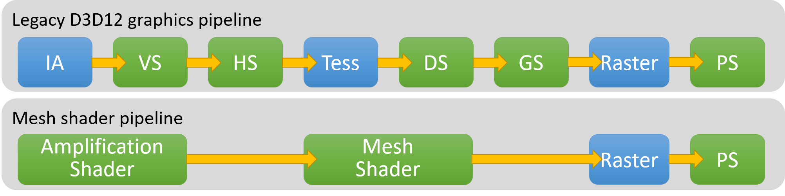

# Mesh Shaders

Mesh shaders are the modern way of writing shaders that perform the vertex transformation. If implemented correctly, they are faster than the legacy vertex shaders and offer a lot more flexibility in term of data layout for the meshes. On the other size it is more complicated to setup than vertex shaders and there are less examples or tutorials that explain well how to get started on mesh shaders.

## Cluster & Meshlets

The first step on how to understand mesh shaders is to explain the operation that are performed on the mesh data itself before sending it to the mesh shader. Indeed, to achieve correct performances, we can't throw the mesh data directly as input of the mesh shader, the mesh need to be split in smaller parts called meshlets. Each meshlet is a group of triangles forming a patch on the surface of the mesh. In the image below, each colored patch represent a single meshlet:

You might notice that most of the meshlets generated are roughly the same size. This is the result of the meshlet generation algorithm trying to minimize the bounding volume of each meshlet while trying to maximize the [vertex reuse](https://interplayoflight.wordpress.com/2021/11/14/shaded-vertex-reuse-on-modern-gpus/) inside each meshlet. Minimizing the bounding volume will be important later on when implementing a meshlet culling algorithm that we'll see in a future chapter.

To generate the meshlets in this course I'll be relying on the [meshoptimizer](https://github.com/zeux/meshoptimizer?tab=readme-ov-file#mesh-shading) which does a great job in generating meshlet data ready for the GPU.

Cluster are a similar concept to meshlets in the way that they are also composed of parts of meshes, the difference is that clusters are primarily oriented in spatially splitting the mesh to accelerate an algorithm like ray-tracing. Clusters can be used in any algorithm and thus, they are not tied to the constraints of mesh shaders.

## The Graphics Pipeline

Here you can see in this diagram form the DirectX 12 documentation, the chain of shader types executed by the GPU when an object is rendered. The blue nodes represent fixed hardware functions, fixed hardware mean that it physically exists on the GPU silicium, hence it can't be programmed, that's why we call it fixed hardware functions, usually these fixed hardware functions act as the glue between the different stages of the shaders by passing and converting data from one stage to another.

In this guide, we'll focus on the Mesh Shader Pipeline which is the new preferred way of rendering objects in new graphics APIs. You'll see that it's simpler to understand because it has less stages and fixed hardware functions. If you want to learn more about the legacy graphics pipeline stages, you can read more in the [DirectX 11 documentation](https://learn.microsoft.com/en-us/windows/win32/direct3d11/overviews-direct3d-11-graphics-pipeline).

## Mesh Shaders

Mesh shaders are very similar to compute shaders, with a few extra features that specializes them for processing geometry. The most important thing to note is that the mesh shader output is directly connected to the rasterizer, this means that on top of doing vertex transformation operations, the mesh shader assembles the geometry that will feed the rasterizer. If you look at the pipeline picture above, mesh shader actually replaces the **Input Assembly (IA)** and **Vertex Shader (VS)** stage.

### Inputs

A Mesh shader reads it's data exactly like a compute shader, usually from buffers storing the meshlet data. This flexibility provides great opportunities to optimize the mesh data by compressing, quantizing or rearranging how its laid out.

For example the meshlet data could be stored in several buffers describing the list of meshlets composing the mesh. In this course we're using the representation implemented by meshoptimizer
The meshlet data contains 

layout(binding = 0) readonly buffer Meshlets { Meshlet meshlets[]; };
layout(binding = 1) readonly buffer MeshletVertices { uint meshlet_vertices[]; };
layout(binding = 2) readonly buffer MeshletTriangles { uint8_t meshlet_triangles[]; };
layout(binding = 2) readonly buffer VertexBuffer { Vertex vertices[]; };

### Output Vertices

### Output Indices

### Output Primitives

### Limitations

In DirectX 12 max output geometry per workgroup:
- 256 vertices
- 256 triangles

## Amplification / Task Shaders

The amplification shader is an optional stage in the mesh shader pipeline that can take any data as input and outputs a list of meshlets for the next stage (Mesh Shader). A vertex stores all the data needed to describe a mesh, usually each vertex has it's position, UVs, normal, etc. but the encoding of such data is fully controllable so you could pack data in any particular way you want as long as you have the code to interpret it correctly in the mesh shader.

// TODO: find another way to say that, too technical too early

This stage is called Amplification because it can generate more geometry as output than it has as input. Such use case is very handy as it serves as a replacement for the tessellation and facilitate LOD technique implementation.

If this stage is not present, the mesh shader will be called for each vertex

## Fragment Shaders

While the fragment shader is not part of the mesh shading pipeline as it is also present in the legacy vertex shader path, the mesh shader have a special connection to the fragment shader, allowing to drive properties that used to be auto generated like SV_PrimitiveID. They also allows you to use an 8 bit index buffer instead of 16 or 32, which increases the bandwidth for the rasterizer.

They also allow you to perform per-triangle culling using a semantic called SV_CullPrimitive to avoid sending a triangle to the rasterizer. It's worth noting that this extra flexibility allows to better optimize rendering algorithms by minimizing the work done by fixed-pipeline functions which have a fixed work rate. A good example of that is the triangle culling rate explained in the excellent presentation [Optimizing the Graphics Pipeline with Compute](https://ubm-twvideo01.s3.amazonaws.com/o1/vault/gdc2016/Presentations/Wihlidal_Graham_OptimizingTheGraphics.pdf). A GPU can issue 4 triangle per clock, but in that same time can issue 384 instructions, so if we can cull a triangle faster than that, then we go faster than the hardware and save work for the rasterizer.

## Implementation

TODO: mesh optimizer + buffer setup + sample mesh shader in HLSL

## Conclusion

## References

- 📄 [From Vertex Shader to Mesh Shader - Mesh Shaders on AMD RDNA™ Graphics Cards](https://gpuopen.com/learn/mesh_shaders/mesh_shaders-from_vertex_shader_to_mesh_shader/)
- 📄 [Mesh Shaders - DirectX-Specs](https://microsoft.github.io/DirectX-Specs/d3d/MeshShader.html)
- 📄 [Introduction to Turing Mesh Shaders - NVIDIA Technical Blog](https://developer.nvidia.com/blog/introduction-turing-mesh-shaders/)
- 📄 [Optimizing the Graphics Pipeline with Compute - GDC 2016](https://ubm-twvideo01.s3.amazonaws.com/o1/vault/gdc2016/Presentations/Wihlidal_Graham_OptimizingTheGraphics.pdf)
- 📄 [meshoptimizer - Github](https://github.com/zeux/meshoptimizer?tab=readme-ov-file#mesh-shading)
- 🎥 [Mesh Shaders - The Future of Rendering](https://www.youtube.com/watch?v=3EMdMD1PsgY)
